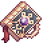

<div align="center">
  <h1>
    
    <sub>Grimdepth</sub>
  </h1>
  <h3>A modern Fabric mod that makes deep underground just bit more scary.</h3>
</div>

## About this mod
This mod was originally a datapack that I've created to slightly boost monsters deep underground, make them just a bit more scary to deal with - so even player in end game gear can find them challenging at times.

**Grimdepth** works mostly at `Y < 0` in overworld and attempts to blend well with Vanilla. It only adds 2 new enchants, everything else is still from base game. Almost everything can be configured in `grimdepth.json` that is generated in game files after first launch.

## List of features
- Adds 2 new enchants to make up for the increased difficulty:
  * `Armor Piercer`: Makes weapons ignore 10%/20%/30% of enemy's armor. It's a rare enchantment found in dungeons (mob spawner dungeon, trial chambers, underwater ruins/pyramids, desert pyramids, jungle temples) and very rarely traded by villagers (librarians). Works with any swords, axes, bows, crossbows, tridents, spears & maces.
  * `Backstep`: Similarly to Armor Piercer, it's a rare enchant found in same dungeons and very rarely appears in villager trades. It helps players to avoid danger by gently pushing them backward and granting a short burst of movement speed after successfully releasing an arrow from a bow, firing from a crossbow, or throwing a trident. It includes safe-floor checks so you won't accidentally recoil into lava, fire, or off cliffs.
- Makes Zombie Leaders more special by extending their vanilla mechanics:
  * All Zombie Leaders are now marked with death particles, making them easier to spot in the dark.
  * Zombie Leaders receive a slight bonus to movement speed & jump boost and are always granted an iron sword + 2 random pieces of iron/chainmail equipment.
  * Slightly increase their chance to spawn closer to bedrock layer (in overworld).
- Scales the danger of Skeletons and Zombies deeper underground (starting from `Y < 0`):
  * Skeletons will always use bows, but have an increasing chance to spawn with enchanted bows (Power or Armor Piercer). In deepslate caverns, enchanted skeletons also receive the Backstep enchantment — when they shoot their bow, they will actively leap backward away from the player if safe ground is available behind them.
  * Zombies may be found with random pieces of equipment they had before turning into a monster (shovels, pickaxes, or swords).
- Makes underground Creepers more unpredictable:
  * Some Creepers from deepslate level can detonate faster, giving players less time to react.
  * Deep underground creepers will seek out and blow any player made light sources to plunge caves back into darkness.
- Changes deepslate Spiders (`Y < 0`) to better fit narrow cave environments:
  * All deepslate spiders are smaller than usual, making them nimbler and harder to hit in tight passages.
  * When defeated, they trigger the `Weaving` effect, scattering cobwebs on death.
- Overhauls cave lighting and the Night Vision effect for darker atmosphere:
  * All caves are now ~33% darker.
  * Night Vision effect now adds +25% brightness to player's vision (per level, max 250%).
- Adds `Nightmare Awareness` - a new status effect & mechanic:
  * Mining naturally generated deepslate ores has a chance to inflict this effect. The chance grows higher when mining in pitch darkness and ore rarity.
  * Effect itself - while active: stirs the darkness around player. Hostile monsters will periodically manifest from nearby unlit dark corners and immediately hunt down the player who with this effect.
  * Gaining the effect again while it is still active refreshes the timer and raises its intensity, causing increasingly dangerous monster varieties to emerge from the darkness.

## Mod compatibility
It may or may not work with other mods/datapack which changes monster mob behavior.

It is recommended to combine with [Let Me Despawn](https://modrinth.com/mod/lmd) for performance reasons. Additionally, there's experimental, optional support for [Penchant](https://github.com/ThePotatoArchivist/Penchant) mod.

## Configuration

Settings can be changed in `.minecraft/config/grimdepth.json`:
```json
{
  "general": {
    "undergroundYLevel": 64,
    "deepslateYLevel": 0,
    "bedrockYLevel": -64
  },
  "armorPiercer": {
    "armorPiercingPerLevel": [
      0.1,
      0.2,
      0.3
    ],
    "spawnBlueSkullParticles": true,
    "projectileTrailParticles": true
  },
  "skeletons": {
    "minUndergroundEnchantedBowChance": 0.05,
    "deepslateEnchantedBowChance": 0.25,
    "bedrockEnchantedBowChance": 0.5,
    "maxEnchantLevel": 3
  },
  "zombies": {
    "minUndergroundToolChance": 0.05,
    "deepslateToolChance": 0.25,
    "bedrockToolChance": 0.5,
    "pickaxeChance": 0.7,
    "shovelChance": 0.3,
    "upperLevelsPrimitiveToolChance": 0.8,
    "deepslateAdvancedToolChance": 0.8,
    "primitiveTools": [
      "minecraft:stone_pickaxe",
      "minecraft:stone_shovel"
    ],
    "advancedTools": [
      "minecraft:iron_pickaxe",
      "minecraft:iron_shovel"
    ],
    "leaders": {
      "deepslateLeaderChance": 0.35,
      "maxNearbyLeaders": 2,
      "nearbyLeaderCheckRadius": 64.0,
      "bonusMovementSpeed": 0.1,
      "stepHeight": 1.5,
      "particleProximityRadius": 24.0,
      "leaderArmorPool": [
        "minecraft:iron_helmet",
        "minecraft:iron_chestplate",
        "minecraft:chainmail_leggings",
        "minecraft:chainmail_boots"
      ],
      "armorPiecesCount": 2,
      "weapon": "minecraft:iron_sword",
      "bothEnchantmentsChance": 0.3
    }
  },
  "creepers": {
    "undergroundMinFuseTicks": 20,
    "undergroundMaxFuseTicks": 30,
    "huntLightSources": true,
    "lightSearchHorizontalRange": 12,
    "lightSearchVerticalRange": 4
  },
  "spiders": {
    "deepslateScale": 0.75,
    "breakCobwebSpiderSpawnChance": 0.1
  },
  "backstep": {
    "pushDistanceBlocks": 1.0,
    "scaleWithLevel": false,
    "pushDistancePerLevel": 0.5,
    "speedDurationTicks": 60,
    "speedAmplifier": 0,
    "requireSafeFloor": true,
    "maxSafeDropDistance": 2.0
  },
  "lighting": {
    "defaultGamma": 0.75,
    "brightnessDarkeningScale": 0.6666666666666666,
    "nightVisionBaseBoost": 0.25,
    "nightVisionPerLevelBoost": 0.1,
    "disableNightVisionFlashingShader": true,
    "maxBrightnessCap": 2.0,
    "antiCheatMaxGamma": 1.0,
    "antiCheatResetGamma": 0.75
  },
  "nightmareAwareness": {
    "maxTriggerYLevel": 0,
    "defaultOreChance": 0.1,
    "darkOreChance": 0.35,
    "highRiskOreChance": 0.75,
    "highRiskOres": [
      "minecraft:deepslate_diamond_ore",
      "minecraft:deepslate_emerald_ore"
    ],
    "darkLightLevelThreshold": 0,
    "durationTicks": 600,
    "maxLevel": 10,
    "minSpawnIntervalTicks": 100,
    "maxSpawnIntervalTicks": 200,
    "minSpawnDistance": 12.0,
    "maxSpawnDistance": 24.0,
    "level1Monsters": [
      "minecraft:zombie",
      "minecraft:skeleton",
      "minecraft:spider"
    ],
    "level2Monsters": [
      "minecraft:creeper",
      "minecraft:husk"
    ],
    "level3Monsters": [
      "minecraft:witch",
      "minecraft:cave_spider"
    ]
  },
  "dungeonLoot": {
    "emptyWeight": 18,
    "armorPiercerWeight": 1,
    "backstepWeight": 1
  }
}
```